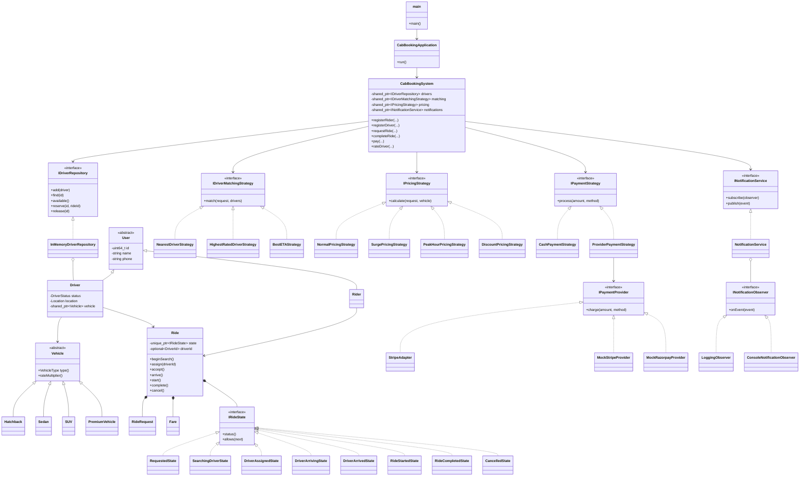
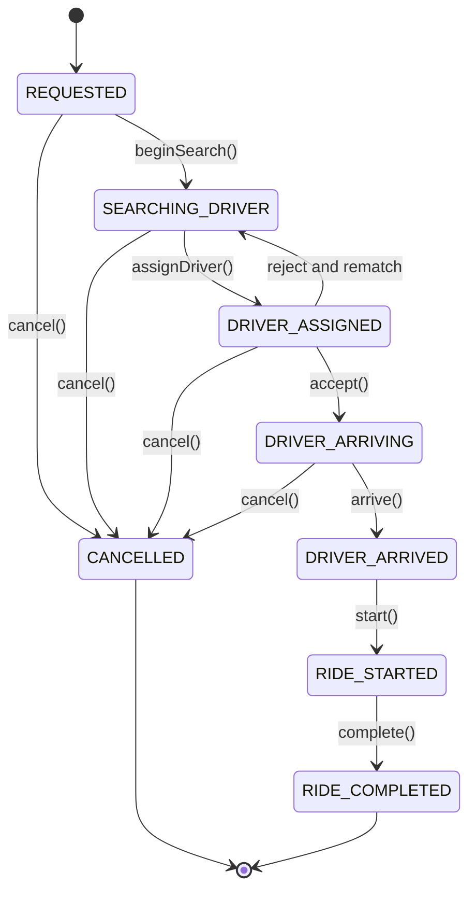
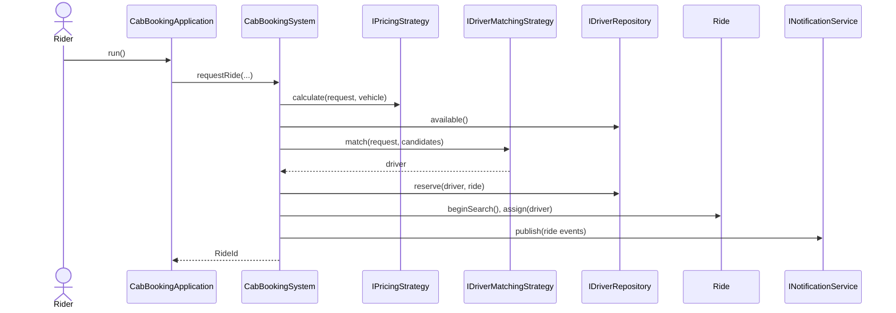
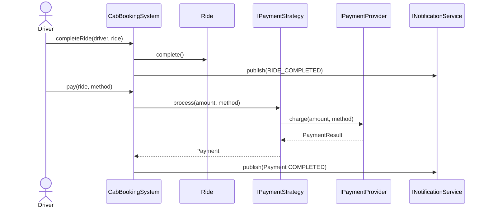
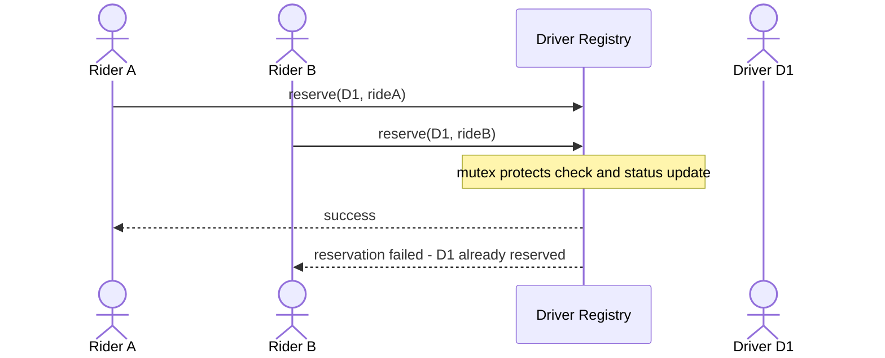

# Uber-Like Cab Booking System

A self-contained C++17 low-level design project for an Uber-like cab booking workflow. It demonstrates object-oriented design, SOLID principles, State, Strategy, Factory, Adapter, Observer, Repository, and Facade patterns without using a database, web framework, REST API, or external service.

## Objective

Model the core cab-booking domain while keeping the client independent from storage, matching algorithms, pricing rules, payment providers, and ride lifecycle details.

## Features

- Rider and driver registration
- Vehicle registration for hatchback, sedan, SUV, and premium vehicles
- Driver online/offline status and location updates
- Ride request, driver matching, and atomic driver reservation
- Nearest-driver, highest-rated, and best-ETA strategy contracts
- Normal, surge, peak-hour, and discount pricing strategies
- Explicit ride state machine
- Cash, card, UPI, and wallet payment strategies
- Mock Stripe/Razorpay provider adapters
- Ride event notifications through observers
- Driver ratings and ride history
- Domain-specific exceptions
- Console output generated by notification events

## Architecture

```text
main.cpp
  -> CabBookingApplication
      -> CabBookingFacade / CabBookingSystem
          -> Domain models and Ride state
          -> IDriverRepository
          -> IDriverMatchingStrategy
          -> IPricingStrategy
          -> IPaymentStrategy / IPaymentProvider
          -> INotificationService / INotificationObserver
```

`main.cpp` is the composition root. It includes `CabBookingApplication.hpp`, which uses only the facade. The implementation is included once through the composition root so `main.cpp` can be compiled directly as a single translation unit.

## Domain Model

### Entities

- `User`: common identity, name, and phone data
- `Rider`: owns ride-history references
- `Driver`: owns availability, location, vehicle reference, earnings/rating data
- `Vehicle`: polymorphic vehicle abstraction
- `Ride`: request, fare, driver assignment, payment-related workflow, and lifecycle state

### Value Objects and Records

- `Location`: latitude, longitude, and distance calculation
- `Money`: amount and currency
- `RideRequest`: rider, pickup, destination, and requested vehicle type
- `Fare`: amount, distance, and duration estimate
- `Payment`: method, amount, and payment status
- `Rating`: ride, rider, driver, and score

### Enumerations

`VehicleType`, `DriverStatus`, `RideStatus`, `PaymentStatus`, and `PaymentMethod` are defined in `enums/DomainEnums.hpp`.

## Complete UML Diagram



## Ride Lifecycle State Diagram



`Ride` owns a polymorphic `IRideState`. Each concrete state defines valid next states. Invalid operations throw `InvalidRideStateException`; cancellation is not allowed after a ride starts.

## Request Ride Sequence



## Complete Ride and Payment Sequence



## Concurrent Driver Assignment



Two riders can request the same available driver concurrently. `InMemoryDriverRepository::reserve()` protects the availability check and status update with one mutex-protected critical section. Therefore, only one reservation succeeds. A single atomic boolean would not protect the complete multi-field reservation transaction.

## Design Patterns

| Pattern | Location | Main Participants | Purpose |
|---|---|---|---|
| State | Ride lifecycle | `Ride`, `IRideState`, concrete states | Encapsulates state-specific transitions |
| Strategy | Driver matching | `IDriverMatchingStrategy` and implementations | Switches matching algorithms |
| Strategy | Pricing | `IPricingStrategy` and implementations | Isolates pricing rules |
| Strategy | Payment | `IPaymentStrategy` and implementations | Isolates payment-method behavior |
| Factory | Vehicle creation | `VehicleFactory`, vehicle classes | Hides concrete vehicle construction |
| Adapter | Payment providers | `IPaymentProvider`, adapters, mock providers | Protects the application from provider APIs |
| Observer | Notifications | `INotificationService`, observers | Publishes events to independent consumers |
| Repository | Data access | `IDriverRepository`, in-memory repository | Separates business logic from storage |
| Facade | Public API | `CabBookingSystem` | Gives the client one simple interface |

## SOLID Mapping

- **Single Responsibility:** Models, strategies, repositories, payment, notifications, and facade orchestration have separate responsibilities.
- **Open/Closed:** New matching, pricing, payment, vehicle, or notification implementations can be added behind existing interfaces.
- **Liskov Substitution:** Concrete strategies and vehicle types are usable through their abstractions.
- **Interface Segregation:** Focused contracts such as `IPricingStrategy`, `IPaymentProvider`, and `INotificationObserver` avoid oversized interfaces.
- **Dependency Inversion:** `CabBookingSystem` depends on injected abstractions instead of concrete repository, pricing, matching, or notification implementations.

## Smart Pointer Ownership

- `shared_ptr` is used for injected services and shared polymorphic domain objects such as drivers and vehicles.
- `unique_ptr` is used for the ride's current state because the ride exclusively owns that state object.
- Value types are used for `Location`, `Money`, `Fare`, and request records.
- No raw owning pointers are used.

## Error Handling

The system uses meaningful exceptions, including:

- `RiderNotFoundException`
- `DriverNotFoundException`
- `RideNotFoundException`
- `NoDriverAvailableException`
- `InvalidRideStateException`
- `DriverAlreadyBusyException`
- `InvalidPaymentException`
- `InvalidRatingException`

## Complexity

With `D` registered drivers:

| Operation | Average Complexity |
|---|---:|
| Register rider/driver | O(1) |
| Find available drivers | O(D) |
| Find nearest driver | O(D) |
| Request ride | O(D) |
| Accept ride | O(1) |
| Cancel ride | O(1) |
| Complete ride | O(1) |

The linear driver scan is intentional for this in-memory LLD project. A production system could add geospatial indexes or distributed matching.

## Project Structure

```text
├── main.cpp                         # Single-file composition root
├── CabBookingApplication.hpp        # Demo runner; facade calls only
├── CabBookingFacade.hpp              # Public facade alias
├── common/Exceptions.hpp             # Domain exceptions
├── core/IRideState.hpp               # Ride state interface and states
├── enums/DomainEnums.hpp             # Shared enum types
├── models/DomainModels.hpp           # Entities and value objects
├── managers/
│   ├── IDriverRepository.hpp         # Repository interface and memory implementation
│   ├── INotificationObserver.hpp     # Observer interface and console observer
│   └── INotificationService.hpp      # Event publisher interface and implementation
├── strategies/
│   ├── IDriverMatchingStrategy.hpp
│   ├── DriverMatchingStrategies.hpp
│   ├── IPricingStrategy.hpp
│   ├── PricingStrategies.hpp
│   └── IPaymentStrategy.hpp
├── payment/
│   ├── IPaymentProvider.hpp
│   └── PaymentStrategies.hpp
├── factories/VehicleFactory.hpp
├── include/cab_booking/cab_booking.hpp # Public umbrella/facade declaration
├── src/cab_booking.cpp               # Implementations included by main.cpp
└── docs/                             # Detailed architecture and pattern notes
```

## Requirements

- MinGW g++ or another C++17 compiler
- PowerShell on Windows, or an equivalent terminal
- No external runtime services

## Run

From the project root:

```powershell
g++ -std=c++17 -I. -Iinclude main.cpp -o main.exe
.\main.exe
```

The application prints registration, location, driver availability, every ride state, payment completion, and rating events through the console notification observer.


