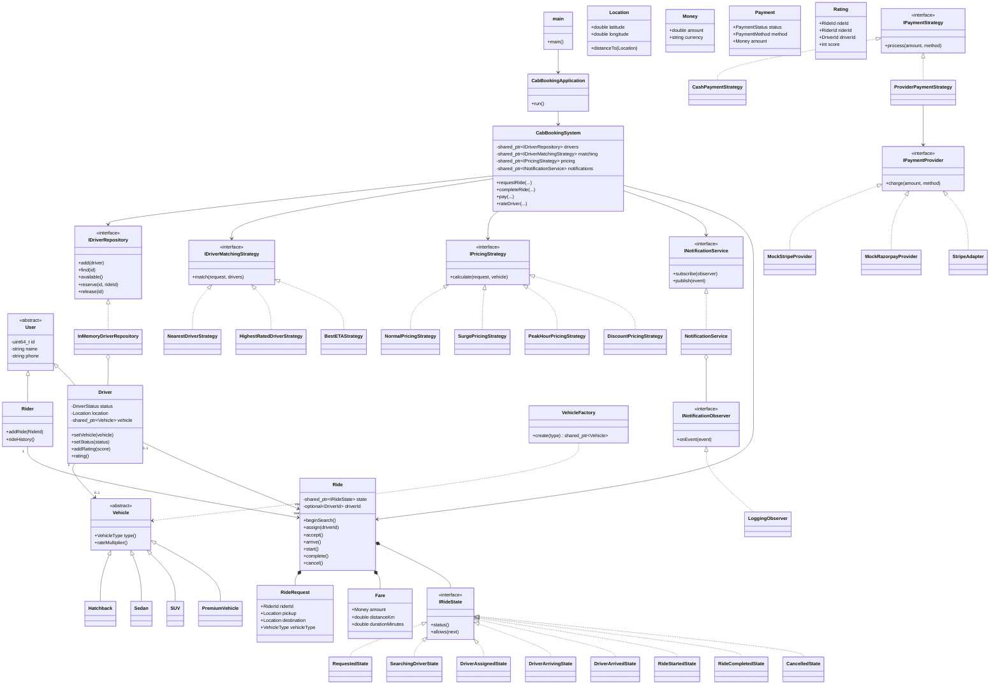
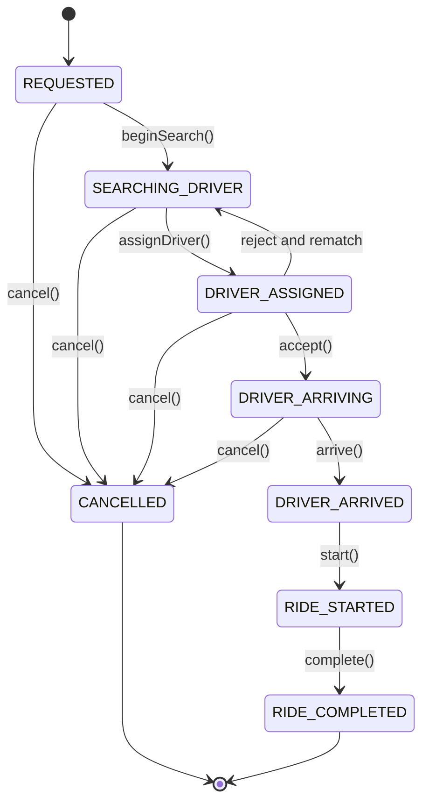
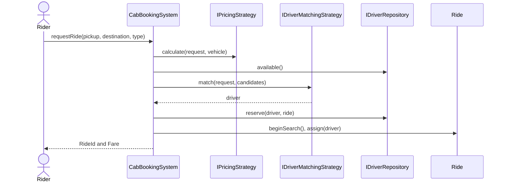
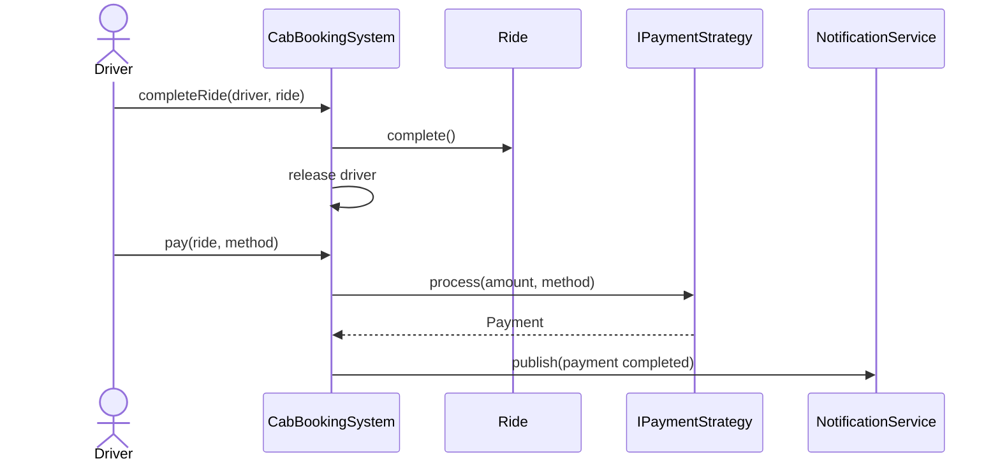

# Architecture and Sequences

## Complete Class Diagram



The composition root is `main.cpp`. It includes `CabBookingApplication.hpp` and the implementation translation unit once, which allows `g++ -std=c++20 -I. -Iinclude main.cpp` to build and run the complete example without a separate linker command.

## Ride Lifecycle State Diagram



## Why `shared_ptr`?

`shared_ptr` is used where several parts of the application need to refer to the same polymorphic object:

- `CabBookingSystem` shares injected repository, strategy, and notification implementations.
- `InMemoryDriverRepository` stores drivers while the facade and active rides may also refer to them.
- `Driver` refers to a polymorphic `Vehicle` created by `VehicleFactory`.
- `Ride` owns a polymorphic state through `unique_ptr`, because the ride exclusively owns its current state.

The pointer gives RAII lifetime management, supports abstract interfaces, and prevents dangling references when an object is shared across service boundaries. It is not a default for every object. Plain values are used for `Location`, `Money`, `Fare`, and request data; `unique_ptr` is preferable for exclusive ownership. In a larger production system, injected services could use references or `unique_ptr` when their lifetime is guaranteed by the composition root. The current `shared_ptr` choice keeps this small in-memory example easy to compose and test.





```mermaid
sequenceDiagram
    actor A as Rider A
    actor B as Rider B
    participant Registry as Driver Registry
    participant D1 as Driver D1

    A->>Registry: reserve(D1, rideA)
    B->>Registry: reserve(D1, rideB)
    Note over Registry: mutex protects check and status update
    Registry-->>A: success
    Registry-->>B: false; D1 already reserved
```

## Concurrency

The reservation critical section contains the availability check and transition to `Reserved`. `std::mutex` and `std::lock_guard` protect the driver map and status. This is sufficient for the in-memory implementation and avoids pretending that an atomic flag can protect a multi-field reservation operation.
